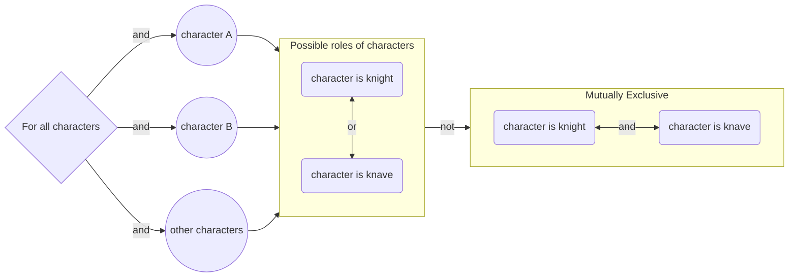
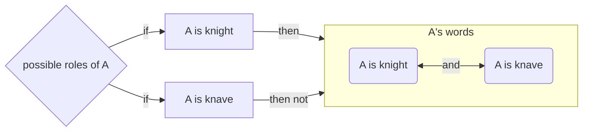
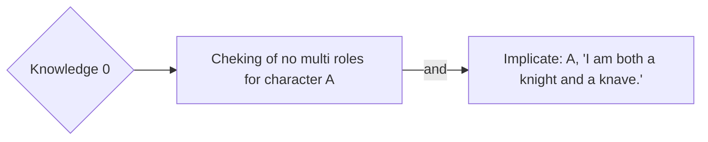
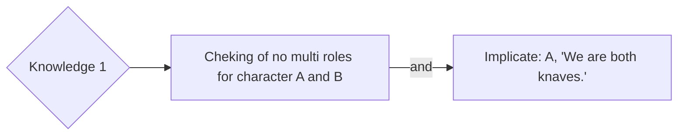
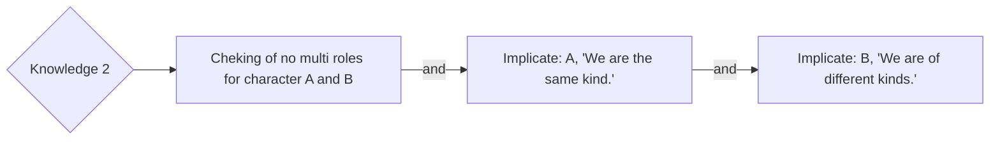
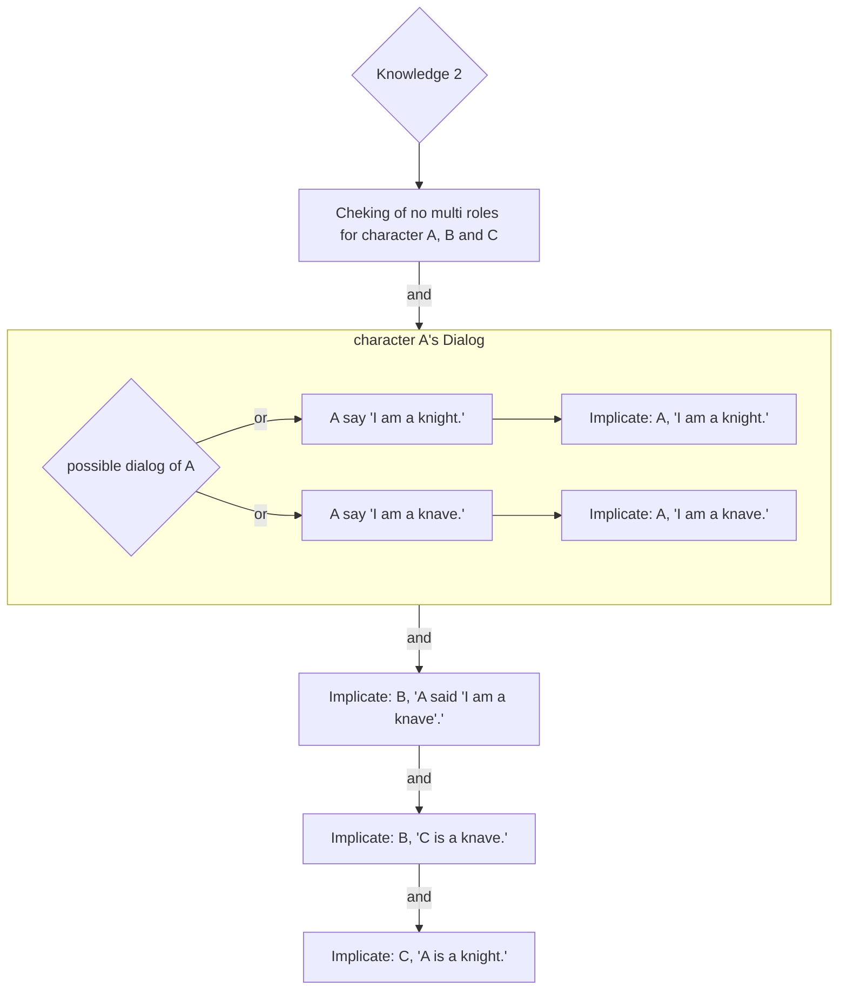

# Backgroudn Information
Here are terms you should understand before reading this file.
 - Knights and Knaves puzzle

 A logical reasoning game

 - proposition

 Statements about the world that can be either true or false

 - logic connectives

 An operation to one or more propositions

 - knowledge base

 A set of sentences known by a knowledge-based agent. For a program, it is knowledge provided about the world in the form of propositional logic sentences that can be used to make additional inferences about the world

 - truth values

 Boolean values include True and False

 - model

 An assignment of a truth value to every proposition

 - entailment 
 
 If A entails B, then in any world where A is true, B is true too.

# Planning
In a Knights and Knaves puzzle, the basic game logic is the following:
 - Each character is either a knight or a knave. 
 - A knight will always tell the truth while a knave will always lie.
The program is aiming to infer each character is a knight or knave based on several provided dialog for four Knights and Knaves puzzles.

For the sake of solving the puzzle, 
the provided dialog should be translated into understanable laguge for the program by the programer using pre-defined logic connectives as the knowledge base.

The success of the program is judged based on the solusion it output for each puzzles.
If the solusion satisfy all dialogs and the basic grame logic, it is considered as a correct solusion such that the program is success.

# Analysis
Definisions of logic connectives and propositional symbol in program laguage is innitally include in the program as the subclass of superclass `Sentence` in **logic.py**.
They are the following:
 - `Symbol`
 Repersentations of propositions, usually are letters.
  > Q = "It is rainy today" Q is a symbol of the proposition "It is rainy today", if it rains today, Q is true.

 - `And`
 As long as one amongst all propositions connected with `And` is false, the expression is false.
  > If A is true, B is false, `And(A,B)` is flase.
 
 - `Not`
 Reverse the true and false of a proposition.
  > If A is true, `Not(A)` is flase.

 - `Or`
 As long as one amongst all propositions connected with `Or` is true, the expression is true.
  > If A is true, B is false, `Or(A,B)` is true.

 - `Implication`
 Represents a structure of "If first proposition(A) is true then second proposition(B) is true." It is able to connect two propositions only and their sequences matters.
  > If A is true, `Implication(A,B)` is true when B is true, false when B is false. The expression will always be true if A is false.

 - `Biconditional`
 Represents a structure of "If and only if first proposition is true then second proposition is true." It is able to connect two propositions only.
  > If both A and B have the same truth value, `Biconditional(A,B)` is true, otherwise the expression is false.
  > As long as one of `Implication(A,B)` and `Implication(B,A)` is false, `Biconditional(A,B)` is false.

The program has the method to infer the solusion for each puzzle base on knowledge bases innitrially.
This method is defined in **puzzle.py** made up by fuctions in **logic.py** including the following steps.
 - enumerating all posisble modles
 - test if the knowledge base entails the proposition which is the slusion of a puzzle. 
  > In other words, answering the question: "can we conclude the solusion is true based on our knowledge base"

The programer has to fill the knowledge base according to the provided dialoge between characters to make this method fuctioning, 
which is translating real world sentences to a type of language that this program is able to understand using the predefined logic connective.

As assuming all innitially provided code of the program is correct, 
any possible errors can be solved by rechek the syntext and context of translations in the knowledge base.

# Design
The following graphs shows some basic stratcure common in each knowledge base
 - Cheking of no multi roles for every charecter


 - Implicate a character's possible roles with the truth value of the proposition stated in their dialog 
  > For readablity, using `Implicate: character, dialog` in the following context.

  > Using character A and A's dialog "I am both a knight and a knave." as example.

 > As mentiond above, "if A then B" means that A `implicates` B, which is the actual logic connectives used in the code. 

 > The two posibile roles of A is acctrally connected using `And`, but since if the frist proposition in `Implication` is false, the expression is always true. Therefore, in each modol, the program will only consider one possible role of A.

The following graphs displaces the logic in each knowledge base
- Knowledge 0


- Knowledge 1


- Knowledge 2

 > translating "We are the same kind." using Biconditional ("We are of different kinds." is `Not("We are the same kind.")`)
 ```mermaid
 graph RL
 A(A is knight) <-->|Biconditional| B(B is knight)
 ```

- Knowledge 3

 > The proposition stated in "A said 'I am a knave'." is a condition having two posibilities conncted using `And`,
 which is similar to `Implicate(A, "I am a knave.")`