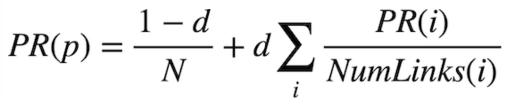
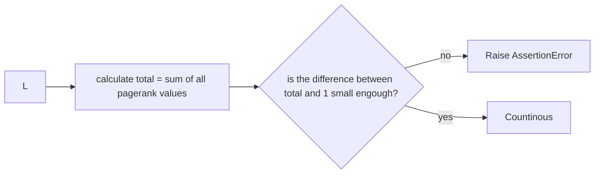
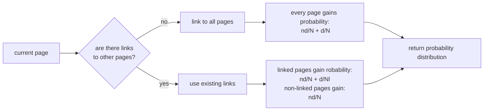
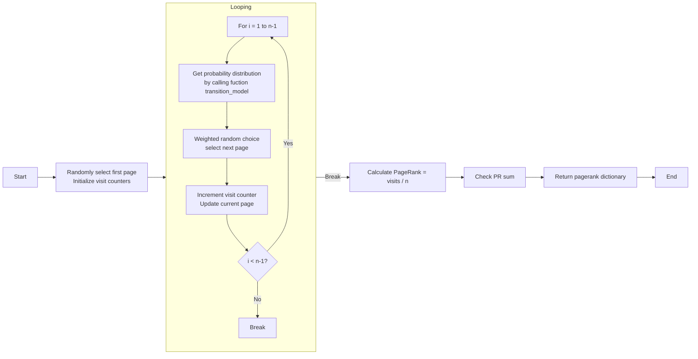
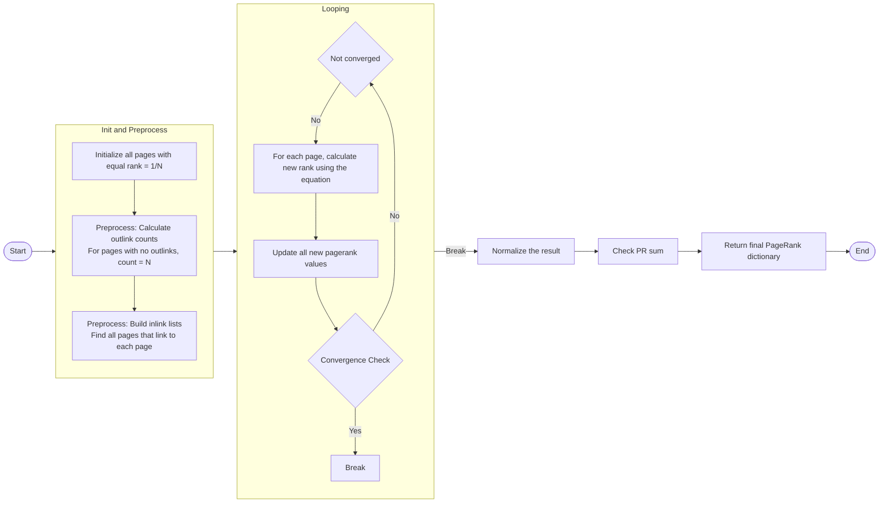
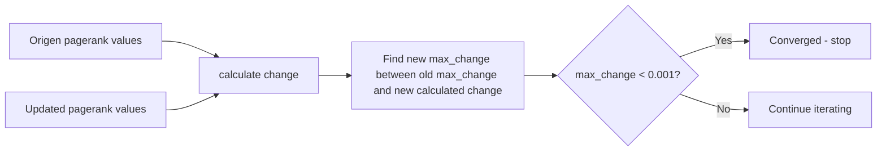

# Backgroudn Information
Here are terms you should understand before reading this file.
1. Hypertext Markup Language files (aka HTML files)

    Files that contains hyperlinks directing to web pages(the argument for web pages in the code is `page`), ended with `.html`.
    > `A.html` is a HTML file that link to web page A

2. Links amongst web pages

    The hyperlink contains in a web page that directing to another one.
    > web page A has a hyperlink to web page B, this is a link between web page A and B, in other words, web page A references web page B.

3. Corpus of web pages (aka Corpus folders)

    Folders that contains a group of HTML files for the sake of testing the project.
    > `Corpus0`, `Corpus1` and `Corpus2` are three Corpus of web pages in this project

4. Relevance of web pages

    This "relevance" is the relevance of a web page to a searched topic on searching engines, which is a measurement of the quality or importance of the web page's reply to the searched topic. 
    > If the searched topic is "how to drive a car", the web page that is recongnized as a heplful answer from the largest amount of visiters will be considerd as the most relevant web page to this topic.

5. Damping factor `d`

    The probebility of the user visit another web page therough a link between two web pages rather than random opne a new web page regardless of weather there is a link between two web pages. This factor is made to ensure the simulated user can always get to somewhere else in the corpus of web pages such that random factors will not affect the ultimate ranking.
    > usually, d = 0.85, which means for any web page a simulat user is visiting, there is a 85% probability it stay on the web page and visited other web pages through a link between two web pages; while there is a 15% probability it randomly visit a new web page regardless of weather there is a link between two web pages.

6. `PageRank’s algorithm`

    It is an algorithm used to measure the relevance of web pages. In `PageRank’s algorithm`, a web page is more relevant if it is linked to by other important web pages, and links from less relevant web pages have their links weighted less. 

# Planning
### Goal of assignment
This project aims to implement PageRank’s algorithm using two methods to rank the importance of all HTML pages in a given corpus.
 1. Sampling：
 
    Simulate a user and record the number of visits to each web page for a large amount of trails and rank them base on the frequency of visits.

 2. Iteration: 
 
    Initially assume all web pages are equally relevant, then iteratively update each page‘s relevance based on the relevance of pages that link to it， until the values stabilize.


### Project requirements
The programer is expected to realizing the aforementioned two methods by completting three abstract functions in **pagerank.py**

### Success criteria
The success criteria of this project include the following:
1. The code of this project is expected to run without rising any errors.

2. The code of this project is expected to generate a ranking similar as manual perdictions
    > If a web page is considered as relevant amongst a corpus of web pages by muman, it is not expected to rank the lowest for this corpus, otherwise there are probably errors exsist in the code.

3. If the project is used for actual searching engines, it is expected to help users find the most relevant result to their searched topic, in other words, the most helpful answer, in shorter time period compare with not applying this project.

# Analysis
### Initial project
The initial project include three corpus folders and the complexity of the links between web pages in these corpora increased one by one. Inaddition, the project include **pagerank.py** that contains two predifined methods.
1. `main()`

    The main method of the project, a fuction that ensure the code is executed with one and only one corpus folders, call two methods to rank them and print out the result.

2. `crawl(directory)`

    Parse a directory of HTML files and check for links from one web page to another. Return a dictionary where each key is a web page, and values are a list of all other web pages in the corpus that are linked to by the web page.

### Development procedure
For the sake of realizing the two methods of ranking webpages, three abstract functions in **pagerank.py** should be complete. They are the following:
1. `transition_model(corpus, page, damping_factor)`

    Exoected to return a probability distribution over which page to visit next,given a current page.

    With probability `damping_factor`, choose a link at random linked to by `page`. With probability `1 - damping_factor`, choose a link at random chosen from all pages in the corpus.

    This function is part of the sampling method, used for estimate which web page the simulate user is going to open next.

2. `sample_pagerank(corpus, damping_factor, n)`

    Expected to return pagerank values for each page as a dictionary where keys are web page names, and values are their estimated pagerank value (a value between 0 and 1).
    
    The pagerank values are estimate by simulate a user visiting `n` pages according to transition model, starting with a page at random. The pagerank value of a web page is `the number of time the page is visited` divided by `n`

3. `iterate_pagerank(corpus, damping_factor)`

    Expected to return pagerank values for each page as a dictionary where keys are web page names, and values are their estimated pagerank value (a value between 0 and 1).

    The pagerank values are estimate by iterating through thenfollowing equation while assume all web pages have equal pagerank value initially.
    
    In the euqation,
    
    `PR(p)` is page p's pagerank, similar for `PR(i)`,
    
    `N` is the total number of pages in the corpus, 
    
    `d` is the `damping_factor`, 
    
    `i` stands for each element in the list of webpages that links to web page p,
    
    `NumLinks(i)`is total number of links to other web pages in web page i.

    Noticed that the change of pagerank value of a web page can affect other web pages, and futhur more affect itself. Such that this fuction is expected to iterate through the calculation until the change of pagerank values per iteration less than 0.001.

    - The logic of the equation is the same as `PageRank’s algorithm`, which is a web page is more relevant if it is linked to by other important web pages, and links from less relevant web pages have their links weighted less. It can be repersent as the following graph:
    ```mermaid
    flowchart LR
        Formula["PR(p) = (1-d)/N + d × Σ(PR(i)/L(i))"]
        
        Term1["(1-d)/N<br>Random jump probability"]
        Term2["d × Σ(PR(i)/L(i))<br>Contribution from inlinks"]
        
        Formula --> Term1
        Formula --> Term2
    ```


### Debug procedure
If their is any error appear while operating the code with a interpreter, the programer is expected to follow the following procedure to debug c:
1. If the interpreter rise any error, go to the prompted line of the code and fix the error according to the instruction of the interpreter.

2. If the interpreter does not rise any error, but also not output as expected, there colde be a infinity loop in the code, add debug output to all the iteration in the code to finde the one without a proper break method and fix it.

3. If the output pagerank value has large difference with manual perdiction, check the lines about calculation, equation used and roundings for mistakes and fix it.

# Design
### Check PR sum
The following graphs shows the logic for checking if the sum of all pagerank values has a difference with `1` less than `1e - 10`
- This checking method is called `Check PR sum` in the following graphs



### Transition model
The following graph show the basic logic of `transition_model(corpus, page, damping_factor)`
- `nd` is the probability of visit random new page (1-d) 
- `N` is the total number of web pages in the corpus
- `Nl` is the total number of links from one web page


### Sample pagerank
The following graph show the basic logic of `sample_pagerank(corpus, damping_factor, n)`


### Iterate pagerank 
The following graph show the basic logic of `iterate_pagerank(corpus, damping_factor)`


### Convergence Check
The following graph show the basic logic of `Convergence Check`
