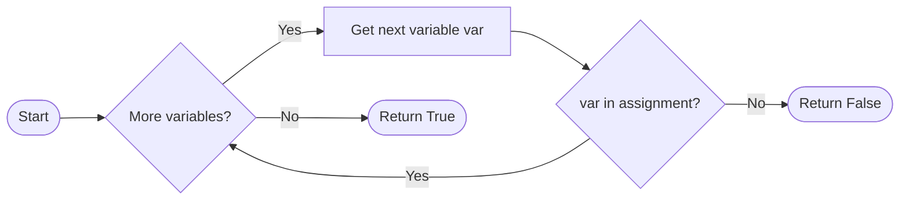
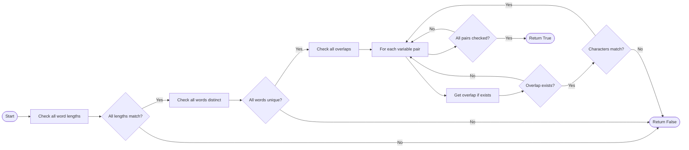
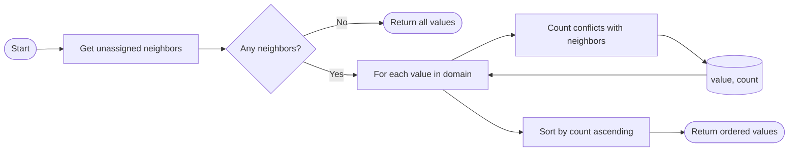
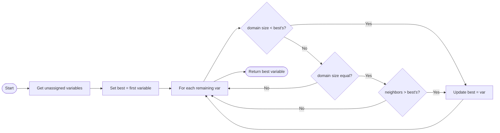
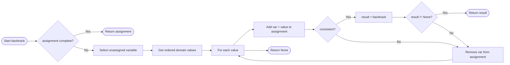

# Backgroudn Information
Here are terms you should understand before reading this file.
1. Constraint Satisfaction Problem (CSP)

    Constraint Satisfaction problems are a class of problems where variables need to be assigned values while satisfying some conditions.
    > In the CSP of crossword puzzle, the variables are blank row or colums needs to be filled with words, which is the assigned value, that satisfy conditions such as the length of a word must be consistent with the number of blank cells etc.

2. Domain of variables

    The set of values that can be signed to variables of a CSP.
    > the domain of variables in the CSP of crossword puzzle is the all meaningfull combaination of 26 letters.

3. Constraints

    Ristrcition needs to be satisfy by the signed values of variables in CSP. Have following types:
     - Unary Constraint: a constraint that involves only one variable. 
        > course A can’t occur on Monday {A ≠ Monday} is a unary constraint to variable course A.
     - Binary Constraint: a constraint that involves two variables. 
        > course A and B can’t occur on the same date {A ≠ B} is a binary constraint to variable course A and B.
     - Global constraint: a constraint that involves all variavles in a certain CSP.
        > all courses can't occur on weekends {All course ≠ Saturday and Sunday} is a global constraint to all variables in the CSP of the date of the courses.

4. Node consistency

    Node consistency is when all the values in a variable’s domain satisfy the variable’s unary constraints.
    > the unary constraint is course A can’t occur on Monday, than the domain: {A = Tuesday, Wednesday, Thursday, Friday, Saturday, Sunday} is node consistent

5. Arc

    Each arc is a tuple `(x, y)` of a variable `x` to a different variable `y`, sequence matters.
    > `(x, y)` is different with `(y, x)`

6. Arc consistency

    Arc consistency is when all the values in a variable’s domain satisfy the variable’s binary constraints
    > to make A arc-consistent with respect to B, remove elements from A’s domain until every choice for A has a possible choice for B.

7. Backtracking search

    A type of a search algorithm that takes into account the structure of a constraint satisfaction search problem. In general, it is a recursive function that attempts to continue assigning values as long as they satisfy the constraints. If constraints are violated, it tries a different assignment.
    > try assigning all values to A in A's domain and find the all values that satisfy all constraint that involves A.

8. Generated crossword puzzle

    In this project, the crossword puzzle, a game of filling in letters to complete words according to the provided letters, number and position of the blank cells, is generated on a grid paper.

9. Assignment

    A dictionary mapping variables to their corresponding words.


# Planning
### Goal of assignment
The project is aiming to generate a crossword puzzle based on the CSP framework with the following constraints:
1. Unary constraint: The length of a word must be consistent with the number of cells.

2. Binary constraint: The letters of two words on the crossed grid must be the same.

3. Global constraint: All words cannot be repeated.


### Project requirements
The programer is expected to realizing the aforementioned goal of the project by completting eight abstract functions in **generate.py** following the basic steps of sloving CSP. (verify node consistency → verify arc consistency → apply backtracking search)

### Success criteria
The success criteria of this project include the following:
1. The code of this project is expected to run without rising any errors.

2. The code of this project is expected to generate a crossword puzzle that satisify the aforementioned constraints (in other words, the generated crossword puzzle should be solvable.)

# Analysis
### Initial project
There are two folders in this project: **assets** and **data**. They initially include the following:
#### **assets**
Contains the typeface for print the puzzle.

#### **data**
Contains two types of files that provides data for the project
1. Structure files

    Files that define the structure of the puzzle (the `_`is used to represent blank cells, any other character represents cells that won’t be filled in)

2. Words files

    Files that define a list of words (one on each line) to use for the vocabulary of the puzzle. 


There are two python files in this project: **crossword.py** and **generate.py**. They initially include the following:
#### **crossword.py**
1. class `Variable`

    Represents a variable in a crossword puzzle, required to be assigned four attributes: the row it begins on `i`, the column it begins on `j`, its `direction` (either the constant `Variable.ACROSS` or the constant `Variable.DOWN`), and its `length`.

2. class `Crossword`

    Represents the puzzle itself, been assigned the following attributes by reading a certain Structure file and Words file.

     - `Crossword.height`: an integer representing the height of the crossword puzzle.
     - `Crossword.width`: an integer representing the width of the crossword puzzle.
     - `Crossword.structure`: a 2D list representing the structure of the puzzle. 
        > For any valid row `i` and column `j`, `Crossword.structure[i][j]` will be True if the cell is blank (a character must be filled there) and will be False otherwise (no character is to be filled in that cell).
     - `Crossword.words`: a set of all of the words to draw from when constructing the crossword puzzle.
     - `Crossword.variables`: a set of all of the variables in the puzzle (each is a `Variable` object).
     - `Crossword.overlaps`: a dictionary mapping a pair of variables to their overlap. 
        > For any two distinct variables `v1` and `v2`, `Crossword.overlaps[v1, v2]` will be None if the two variables have no overlap, and will be a pair of integers (i, j) if the variables do overlap. The pair `(i, j)` should be interpreted to mean that the `i`th character of `v1`’s value must be the same as the `j`th character of `v2`’s value.
    
    2.1. function `neighbors` (class method of class `Crossword`)

        Returns all of the variables that overlap with a given variable. 
        > `crossword.neighbors(v1)` will return a set of all of the variables that are neighbors to the variable `v1`.

#### **generate.py**
1. class `CrosswordCreator`

    Use to generate the crossword puzzle., been sassign two attributes:

     - `crossword`: a `Crossword` object 
     - `domain`: a dictionary that maps variables to a set of possible words the variable might take on as a value. 

2. fuction `print`

    Print to the terminal a representation of your crossword puzzle for a given assignment

3. fuction `save`

    Generate an image file corresponding to a given assignment.

4. fuction `letter_grid`

    A helper function used by both `print` and `save` that generates a 2D list of all characters in their appropriate positions for a given assignment

5. fuction `solve`

    A fuction that generate the puzzle by verify node consistency using, verify arc consistency and apply backtracking search. 

    It calls three abstract fuctions, expected to be realize by the programer, in sequesce to generate the puzzle according to the aforementioned three steps. They are(in sequence) `enforce_node_consistency`, `ac3` and `backtrack`

### Development procedure
For the sake of realizing the aforementioned goal of the project, eight abstract functions in **generate.py** should be complete. They are the following:

1. `enforce_node_consistency`

    Update `self.domains` such that each variable is node consistent. 
    
    It directly chages `CrosswordCreator.domain` and returns nothing

2. `revise`

    Make the variable `x` arc consistent with respect to the variable `y`.

    Check `CrosswordCreator.crossword.overlaps` and delete the overlap value in the domain of variable `x`.
    
    Returns `True` if changes variable `x`'s domain, returns `False` if no changes.

3. `ac3`

    Enforce arc consistency on the CSP of corssword puzzle

    Call `revise` for all arcs in the CSP of corssword puzzle, add the arc back to the list of arcs if the domain of first variable in the arc is changed after the last `revise`.

    Returns `True` if varify arc consistency, returns `False` if unable to enforce arc consistency, which is the domain of a variable is empty after calling `revise`.

4. `assignment_complete`

    Check to see if a given assignment assigned a value to each variable.

    Returns `True` if the assignment is completed, otherwise returns `False`.

5. `consistent`

    Check to see if a given assignment is node consistent and arc consistent.

    Returns `True` if the assignment is consistent, otherwise returns `False`.


6. `order_domain_values`

    Return a list of all of the values in the domain of variable, ordered according to the least-constraining values heuristic.

7. `select_unassigned_variable`

    Return a single variable in the crossword puzzle that is not yet assigned by assignment, according to the minimum remaining value heuristic and then the degree heuristic.

8. `backtrack`

    Accept a partial assignment assignment as input and, using backtracking search, return a complete satisfactory assignment of variables to values if it is possible to do so.


### Debug procedure
If their is any error appear while operating the code with a interpreter, the programer is expected to follow the following procedure to debug c:
1. If the interpreter rise any error, go to the prompted line of the code and fix the error according to the instruction of the interpreter.

2. If the interpreter does not rise any error, but also not output as expected, there colde be a infinity loop in the code, add debug output to all the iteration in the code to finde the one without a proper break method and fix it.

3. If the generated corssword puzzle is not solveable, try to print the list of variables and their domain after each change to it and check manually for the step that dosenot output as expected  according to the expection of fuction realized by the programer in **Development procedure**

# Design
The following graphs shows the logic for each of the eight fuctions the programer realized.
### enforce_node_consistency
```mermaid
flowchart LR
    Start([Start]) --> Loop{More variables?}
    Loop -->|Yes| GetVar[Get next variable var]
    GetVar --> CheckWords[For each word in domain]
    CheckWords --> CheckLen{len(word) == var.length?}
    CheckLen -->|No| Remove[Remove word from domain]
    CheckLen -->|Yes| CheckWords
    Remove --> CheckWords
    CheckWords --> Loop
    Loop -->|No| End([End])
```

### revise
```mermaid
flowchart LR
    Start([Start revise(x,y)]) --> GetOverlap[Get overlap info]
    GetOverlap --> Overlap{Overlap exists?}
    Overlap -->|No| ReturnFalse([Return False])
    Overlap -->|Yes| GetPos[Get (i,j) positions]
    GetPos --> LoopX[For each word_x in domain x]
    LoopX --> FindMatch{Exists word_y with<br>word_x[i] == word_y[j]?}
    FindMatch -->|No| MarkRemove[Mark word_x for removal]
    FindMatch -->|Yes| LoopX
    MarkRemove --> LoopX
    LoopX --> RemoveMarked[Remove marked words]
    RemoveMarked --> Changed{Any removed?}
    Changed -->|Yes| ReturnTrue([Return True])
    Changed -->|No| ReturnFalse
```

### ac3
```mermaid
flowchart LR
    Start([Start ac3]) --> InitQueue[Initialize queue with arcs]
    InitQueue --> QueueEmpty{Queue empty?}
    QueueEmpty -->|Yes| ReturnTrue([Return True])
    QueueEmpty -->|No| Pop[(x,y) = pop queue]
    Pop --> CallRevise[Call revise(x,y)]
    CallRevise --> Revised{revise True?}
    Revised -->|No| QueueEmpty
    Revised -->|Yes| DomainEmpty{domain x empty?}
    DomainEmpty -->|Yes| ReturnFalse([Return False])
    DomainEmpty -->|No| AddNeighbors[Add (z,x) for all neighbors z ≠ y]
    AddNeighbors --> QueueEmpty
```

### assignment_complete


### consistent


### order_domain_values


### select_unassigned_variable


### backtrack

